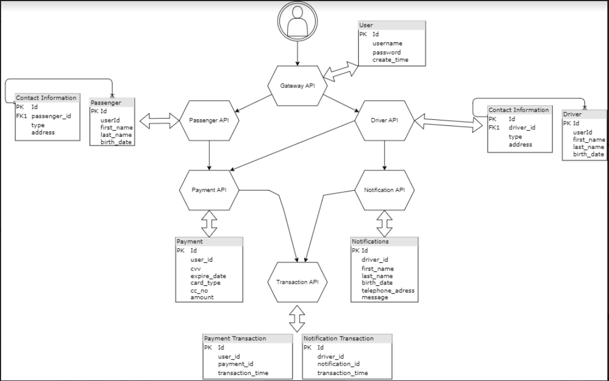

# Diagram

- As Gateway server monolith, I used the SOA architecture infrastructure because it didn't have much room to grow, so we can say that SOA is a layered architecture, but it does give us strength, if the project grows, not as much as a hexagonal and DDD-enhanced structure